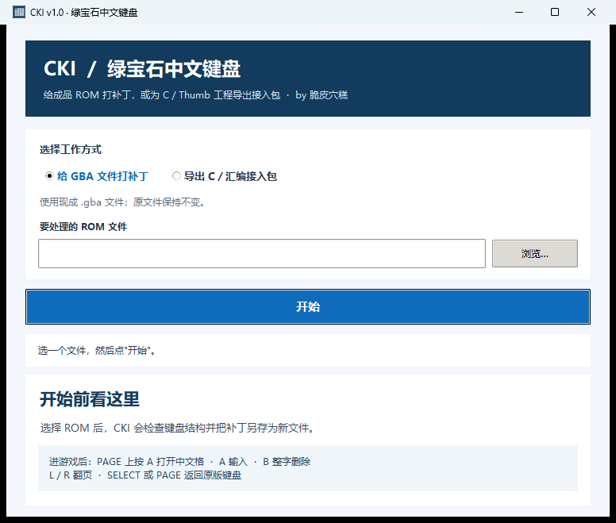
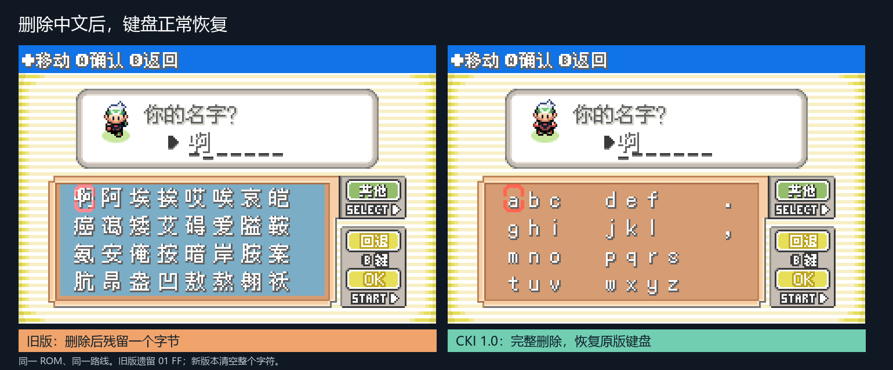
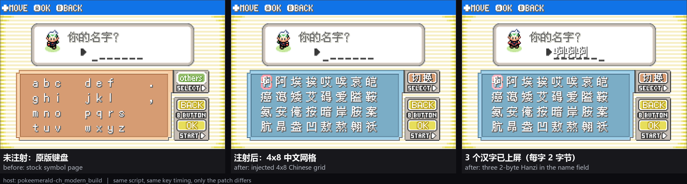
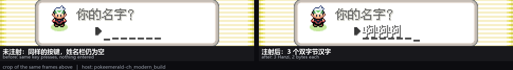

<div align="center">

# CKI · 宝可梦绿宝石中文键盘

给兼容的绿宝石系 GBA ROM 添加中文选字键盘，也为 C／Thumb 汇编改版导出可集成源码。

**By 脆皮穴糕 · xuegao1416**

[](https://github.com/xuegao1416/chinese-keyboard-inject/releases/latest)
[](LICENSE)
[](#下载与启动)

**[下载 CKI v1.0](https://github.com/xuegao1416/chinese-keyboard-inject/releases/tag/v1.0)** · [使用方法](#给-gba-rom-打补丁) · [C源码接入](docs/SOURCE_INTEGRATION.md) · [重编译版兼容证据](docs/DECOMP_COMPATIBILITY.md) · [验证范围](qa/VALIDATION.md)

</div>



## 它能做什么

- **给现成 ROM 打补丁**：选择 `.gba` 文件，检查通过后另存一个新 ROM；原文件不会被覆盖。
- **导出源码接入包**：生成共用字符缓冲核心、C 输入组件和 Thumb 示例，供改版工程手动接入。
- **中文选字**：在游戏的 PAGE 标签上按 A 打开 4×8 网格；方向键选字，A 输入，B 删除一个完整字符，L／R 翻页，SELECT 或 PAGE 返回原版键盘。



## 下载与启动

1. 打开 [GitHub Releases](https://github.com/xuegao1416/chinese-keyboard-inject/releases/latest)，下载 `CKI-v1.0-win64.zip`。
2. 解压整个 ZIP 文件夹。它包含 `CKI.exe`、命令行工具和 ARM 编译器；不要只单独移动 EXE。
3. 双击 `CKI.exe`，选择“给 GBA 文件打补丁”，选 ROM，再点“开始”。成功后，补丁文件和验证报告会保存在 ROM 旁边。

桌面程序只接受可识别的宝可梦绿宝石系结构。未验证或不支持的改版会提示或拒绝；请保留原 ROM，并先在模拟器里检查输出。

## 给 GBA ROM 打补丁

桌面程序是推荐入口。也可以从命令行调用 EXE：

```powershell
.\CKI-CLI.exe --version
.\CKI-CLI.exe inspect "Pokemon Emerald.gba"
.\CKI-CLI.exe inject "Pokemon Emerald.gba" -o "Pokemon Emerald_cki.gba"
```

`inspect` 只做解析与预检。`inject` 另存 ROM 和 JSON 报告；输入 ROM、输出 ROM、报告必须是三个不同文件。

如果从源码运行，需要 Python 3.10+。Windows ZIP 已附带 clang 18.1.3；源码环境还需要可用的 ARM LLVM 工具链：

```powershell
python cki.py
python cki.py inspect "Pokemon Emerald.gba"
python cki.py inject "Pokemon Emerald.gba" -o "Pokemon Emerald_cki.gba"
```

### 游戏里的按键

| 操作 | 效果 |
| --- | --- |
| 在原版 PAGE 标签上按 A | 打开中文选字格 |
| 方向键、A | 移动光标、输入当前字符 |
| B | 删除一个完整字符，含双字节汉字 |
| L／R | 翻页 |
| SELECT 或 PAGE | 返回原版键盘，已输入字符保留 |

当前是 4×8 分页选字，没有拼音检索。

## 给 C／Thumb 汇编改版接入

在桌面程序切换到“导出 C／汇编接入包”，或运行：

```powershell
.\CKI-CLI.exe source .\cki-sdk
```

导出目录必须为空或不存在。工具不会改动原工程；接入方需要把示例绘制、编码与按键回调接到宿主，并遵守游戏的姓名保存容量。完整接口、编译示例和限制见[源码接入说明](docs/SOURCE_INTEGRATION.md)。

## 屏幕效果





## 支持范围与限制

- 本次发布对本地 25 个已知 ROM 输入进行了重新验证：24 个通过运行与边界检查，1 个因键盘窗口结构不符而被安全拒绝。完整输入哈希和各项结果见[验证记录](qa/VALIDATION.md)与[机器可读摘要](qa/validation.json)。
- 这批 ROM 实测主要验证**二进制 ROM 注入路径**，包含 C／Thumb 重编译改版的构建产物；它不代表 SDK 已在 25 个源码工程里完成集成。详见[重编译改版兼容证据](docs/DECOMP_COMPATIBILITY.md)。
- 汉字显示依赖 ROM 自带中文字库。CKI 不带字体，不会给英文 ROM 凭空增加汉字显示。
- 不扩展存档姓名字段。姓名可写入容量取决于游戏的具体字段和保存代码。
- 机器码解析会拒绝无法识别或有歧义的键盘结构；“绿宝石系”不代表任意改版都能直接支持。
- 源码 SDK 提供输入与缓冲核心，不自动修改工程，也不代替宿主的字库、绘制、编码或存档适配。

## 从源码构建

```powershell
python -m pip install -r requirements-build.txt
python -m unittest discover -s tests -v
python injector/gui.py --self-test
python tools/build_windows_exe.py --out build\cki-exe
python tools/build_windows_package.py --toolchain-dir PATH_TO_LLVM_18.1.3 --exe-dir build\cki-exe --out dist --verify
```

`tools/build_windows_exe.py` 使用 PyInstaller 构建双击版 EXE。完整验证范围和复现入口见 [`qa/VALIDATION.md`](qa/VALIDATION.md)。

## 许可

CKI 源码按 [MIT License](LICENSE) 发布。版权与作者署名是 **脆皮穴糕（xuegao1416）**；再分发时请保留 [LICENSE](LICENSE) 和 [CREDITS](CREDITS.md)。GitHub 可通过 [`CITATION.cff`](CITATION.cff) 显示引用信息。游戏 ROM 和宝可梦素材不包含在源码或发布包中；请自行提供合法取得的 ROM。
